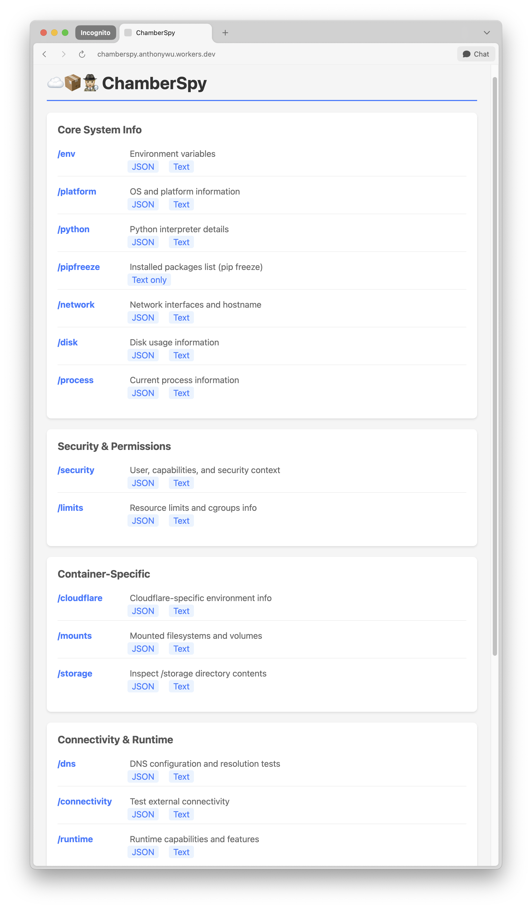

# cloudflare-containers-chamberspy

[](https://deploy.workers.cloudflare.com/?url=https://github.com/anthonywu/cloudflare-containers-chamberspy)

Deploying a Environment inspection FastAPI application to [Cloudflare Containers](https://developers.cloudflare.com/containers/) for the purpose of understanding the runtime of the [Firecracker container](https://firecracker-microvm.github.io) backing your [Worker](https://workers.cloudflare.com). This is as close as you can get to "bare metal" in this cloud offering. [more on WHY?](https://x.com/anthonywu/status/1948173891526074750)




# Usage

This repo is meant to serve as a **Developer Education** reference, supplementing the official docs.

You should:

1. deploy this or a fork of this repo to your Cloudflare account and observe that it works as advertised
1. copy/paste relevant parts of this repo to your actual app
1. when your page/routes are up, visit the `format=json` routes with a json prettifier browser extension or `curl` output to `jq`
1. study the system resources to understand how to deploy and run your app in this environment
1. when you successfully deploy "v1" of your app, you won't need this setup anymore

## The important parts

1. `wrangler.jsonc` - this is the config that drives your `wrangler` commands
1. `index.ts` - the main entrypoint for your Cloudflare workers, proxies traffic to backend container
1. `Dockerfile` - this is the spec for the backend container

All other files are just Python/TypeScript scaffolding. I wish they were abstracted away.

# Contribute

You can ignore this section if you just want to deploy this repo as a template, or you just want to copy/paste to your project.

## Pre-requisites

Skip this if you _know what you're doing_

Install or run these tools however you want: `curl ... | sh`, `brew`, `nix`, `npm install -g`, `npx`, `bunx` - it's up to you.

1. [wrangler](https://developers.cloudflare.com/workers/wrangler/install-and-update/)
1. [bun](https://bun.com/)
1. [just](https://just.systems/man/en/packages.html)

### Develop the Python admin API app

From the `./app` subdirectory, run the FastAPI server locally with:

```bash
uv venv
. .venv/bin/activate
uv pip install -e .
uvicorn main:app --port 30000
```

test the Python-only app on `http://localhost:30000`

### Develop the Docker container

From the repository root, build the container artifact locally:

```bash
bun install
docker build -t chamberspy:latest .

then validate your app locally, without involving wrangler/cloudflare at all
```bash
docker run -it -p 30000:30000 chamberspy:latest
```

again, test the Python-only app in local container runtime and access on `http://localhost:30000`

### Test and Deploy with Cloudflare integration

```bash
wrangler dev --port 30000  # or 'just dev'
```

NOTE: you will need to visit `http://localhost:30000` to cause your container to start up on demand in Miniflare. Closely tail your terminal log at this point.

If the local Miniflare dev deployment looks good, then deploy to Cloudflare with:

```bash
wrangler deploy # or 'just deploy'
```

- A successful deploy will display the URL of your deployed https app in the output.
- For example: `https://chamberspy.yourworkersubdomain.workers.dev`
- You NEED TO WAIT a few minutes for it to be available from cold start.
- Check your **Cloudflare Account Home** -> **Compute (Workers)** -> **Containers** web dashboard for more information. 

Useful commands to follow up:

```bash
wrangler deployments status
wrangler containers --help
```

## Troubleshooting

- 💸 During the containers beta, you must be on at least the [$5 Workers Paid Plan](https://dash.cloudflare.com/?to=/:account/workers/plans/purchase) to deploy containers, otherwise you will encounter `Unauthorized Errors` during `wrangler deploy` step.
- If you paid for the plan and still see `Unauthorized Errors`, do `npx wrangler logout` then `npx wrangler login` to refresh your permission scopes

Further exploration of Cloudflare is out of scope of this repo. Consult [Cloudflare official docs](https://developers.cloudflare.com).
